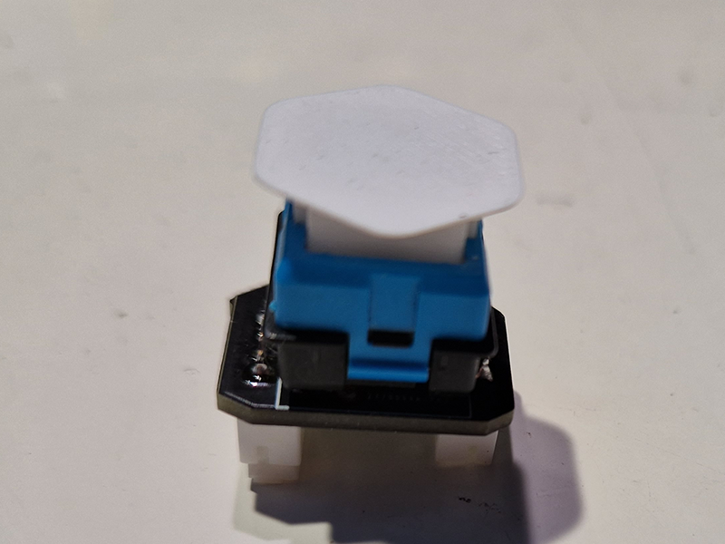
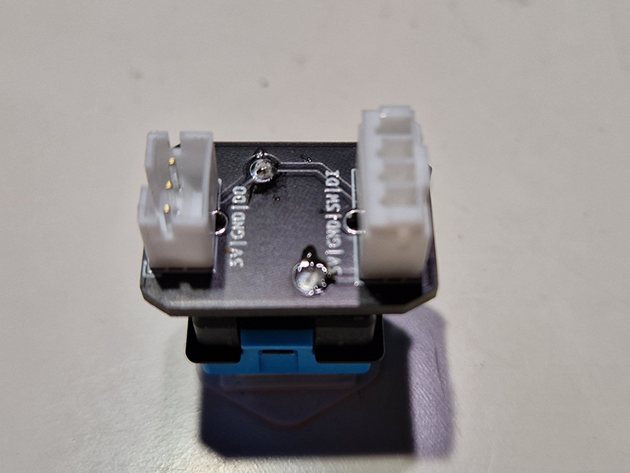
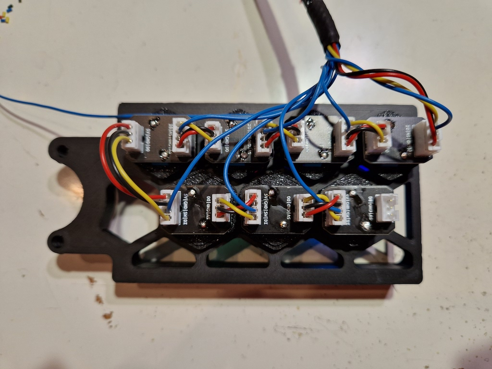

**G-Code Button PCB for [Agent Cain's Gcode Buttons](https://github.com/Agent-Cain/VoronUsers/tree/Voron-2_RGB_G-Code_Button/printer_mods/Agent-Cain/rgb_gcode-button)**

**BOM**
|Part NO.  |Qty  |LCSC  |Ali|
|--|--|--|--|
| Conn_01x03 | 1 | C131339 |[Link](https://s.click.aliexpress.com/e/_DlHystD)|
| Conn_01x04 | 1 | C131334 |[Link](https://s.click.aliexpress.com/e/_DlHystD)|
| WS2812-2020 | 1 | C114586 | |
| ROMER_G | 1 | --- |[Link](https://s.click.aliexpress.com/e/_DDhs1G3)|

**Assembly**
- Order the pcb at e.g. [pcbway](https://www.pcbway.com/project/shareproject/G_Code_Button_PCB_for_Agent_Cain_s_Gcode_Buttons_28c76498.html) or [jlcpcb](https://jlcpcb.com/)
- Order the buttons at e.g. [aliexpress](https://s.click.aliexpress.com/e/_DDhs1G3)
- Order the PH connectors at e.g. [aliexpress](https://s.click.aliexpress.com/e/_DdgpLUT)
- Assemble the PCB, the led is solderable by hand with a fine tip
- Wire up the pcbs to your controller
    - You can wire multiple pcb's in series, just go from data out (DO) to data in (DI) and expose only the switch (SW) cable for every pcb to your controller
- Add them as gcode buttons to your config
```
[gcode_button _EMERGENCY]
pin: ^!PE8
press_gcode:
    M112
```

- if you wan't e.g. a color change during press and macro execution, you can do it like this
```
[gcode_button _FILAMENT_UNLOAD]
pin: ^!PC12
press_gcode:
    SET_LED LED=buttons RED=1 GREEN=0 BLUE=0 index=2
    FILAMENT_UNLOAD
    SET_LED LED=buttons RED=1 GREEN=0.5 BLUE=0 index=2
```
- 
- 
- 

## Troubleshooting
- Problem: My Leds showing Random colors
    - Solution: Add a ~400Ω Resistor on the data line

## Notes
- You can contact me via Discord "Gi7mo!#4618"
- This readme file contains Amazon Associate, Aliexpress affiliate, PCBWay affiliate links. I make a comission on qualifying purchases.
- This project does not come with any warranty, if you choose to build/use one, you are doing this at your own risk!
